# Loupe

**Point at your running app. Say what is wrong. An agent gets everything it needs.**

Loupe is an annotation SDK you compile into the dev or staging build of your own app.
You enter annotate mode, pick an element, leave a comment, pick another, leave another.
Each pick is captured automatically: a picture of the exact element, the API calls that
screen just made, the errors, the build it came from. One **Send** ships the batch.

Point at one element, or **drag a rectangle** around whatever you actually mean. A
gap, two things that disagree with each other, the padding round a group: plenty of
real feedback is not about a single element, and no view corresponds to it.

You never take a screenshot. You never write repro steps. You never fill in a ticket.

**macOS, iPad, iPhone, the browser, and Electron.** Two SDKs, one bundle format.

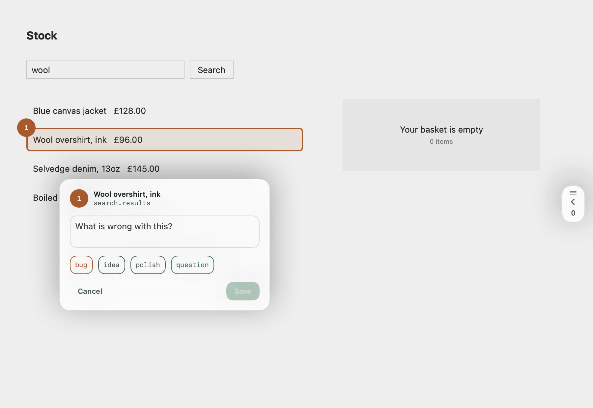

## Why this exists

Handing an AI coding agent "the search feels wrong" gets you a guess. Handing it the
element you pointed at, a picture of it, and the exact request that fired behind it gets
you a fix. Loupe is the capture side of that.

## Straight into Linear

Capture is half the job. `LoupeLinear` takes the other half: each note becomes its
own Linear issue, with both screenshots attached and the network trace in the body.

```swift
Loupe.start(app: app, transport: LinearDelivery(keeping: FileTransport(directory: dir)))
LoupeLinear.enable()
```

Two lines, and a settings panel appears behind the drawer's gear where someone can
paste a personal API key or sign in with Linear. The credential goes to the Keychain.
The workspace is shown, because a credential belongs to exactly one; team and project
are pickers, because nobody types a UUID on an iPad.

**A send that did not reach Linear never reports success.** If Linear is not set up
yet, Send fails and says so - it does not quietly keep the note in a folder and tell
you it was delivered. The local copy is always written first, so nothing is ever lost;
only the reporting was ever in question.

**The tag you pick becomes a Linear label, when your workspace already has one of
that name.** Matching ignores case, so `bug` finds `Bug`. Loupe never creates a
label: your labels are your taxonomy, and filing a note from an iPad is not the
moment to add to it. When nothing matches, the tag is written into the issue body as
a sentence instead - so the choice still arrives, and you can add the label yourself
if you want it to stick next time.

**One issue per note, never one per batch** - a session's notes are unrelated to each
other. Sending is safe to repeat: a note whose issue already exists is a no-op, so a
retry after a dropped connection cannot double-file.

**Your app needs a Keychain entitlement, and this is not optional.** The credential is
stored in the Keychain and nowhere else, and an app without the entitlement is refused
outright - on Mac Catalyst especially. Add the **Keychain Sharing** capability, or set
`keychain-access-groups` to `$(AppIdentifierPrefix)<your bundle id>`. Loupe says so in
the panel if the write is refused, rather than closing as though it worked: an earlier
version returned a discarded `Bool`, and somebody lost a key to that silence.

To sign in with Linear instead of pasting a key, register an application at
`https://linear.app/settings/api/applications/new`, give it a callback URL your app
handles, and pass the client id:

```swift
LoupeLinear.enable(oauth: LinearOAuth(clientID: "…", redirectURI: "yourapp://linear"))
```

A client id is public - PKCE is what removes the need for a secret, so none ships in
your binary. Leave `oauth` out and the panel offers the API key field alone.

`LoupeCore` has no idea any of this exists. A host that wants capture only never
takes the product.

## Related: Autopilot

**Loupe captures. [Autopilot](https://github.com/serhii-kucherenko/autopilot) decides what to do about it.**

Loupe hands over a bundle and stops there. Autopilot is the loop on the other side: triage
into tickets, an agent that builds them, staging, and the review that closes it.

The seam between the two is the bundle format, and it is deliberate. Loupe only ever POSTs
to a URL you configure, with no opinion about issue trackers or agents, so you can adopt
the capture without adopting the loop. Autopilot can equally take input from anywhere else.

| | What it is | Where |
|---|---|---|
| **Loupe** | the annotation SDK, in your app | this repo · [Linear](https://linear.app/serhii-kucherenko/project/loupe-8fd34fb80084) |
| **Autopilot** | the loop the bundles feed | https://github.com/serhii-kucherenko/autopilot · [Linear](https://linear.app/serhii-kucherenko/project/autopilot-0e1846433181) |

Both came out of [SER-601](https://linear.app/serhii-kucherenko/issue/SER-601).

## Install

### Apple platforms

Swift Package Manager:

```swift
.package(url: "https://github.com/serhii-kucherenko/loupe", from: "0.1.2")
```

Pre-1.0 on purpose: the bundle format is settled, but the SDK API is young, so the shape
may still move. Take 0.1.2 or later. It is the first version that can send into Linear, and
the first where the picker is trustworthy on iOS: earlier ones could not reliably take a tap
on their own controls, and could hand you a whole shelf of the screen when you pointed at one
row inside it.

**If SwiftPM refuses to resolve Loupe at all**, with a fingerprint or "not signed with the
same identity" error, delete `~/Library/org.swift.swiftpm/security/fingerprints/loupe-*.json`
and resolve again. The `v0.1.0` tag was moved once, before the first adopter existed, and
SwiftPM remembers the commit a tag pointed at the first time it saw it. No tag will be
moved again.

Then add the products you need. `LoupeCore` alone is enough to read or write bundles;
`LoupeUI` brings in the picker and the platform code.

```swift
.product(name: "LoupeCore", package: "loupe"),
.product(name: "LoupeUI", package: "loupe"),
.product(name: "LoupeLinear", package: "loupe"),  // only if you want the Linear delivery
```

Requires Swift 5.9, macOS 13, or iOS 16. **Mac Catalyst is supported**, and the sources
compile clean in Swift 6 language mode - both are checked by CI, because neither the macOS
job nor the iOS job can catch a break in them.

### Web and Electron

```sh
npm install loupe-web
```

[](https://www.npmjs.com/package/loupe-web)
No runtime dependencies. See [`web/README.md`](web/README.md). Electron comes free: its
renderer is Chromium.

## Install it with an agent

Loupe is meant to be wired in by the same agent that will read its output, so the
instructions are written for one. Paste this at your coding agent:

> Install Loupe into this project by following
> https://raw.githubusercontent.com/serhii-kucherenko/loupe/main/docs/agent-install.md
> Do not skip the verification section.

[`docs/agent-install.md`](docs/agent-install.md) covers both halves, the dev-only guard, an
intake route that writes bundles **into the repository** so the agent can read them, and a
verification checklist it has to pass before reporting the job done.

## Use

Two calls at launch, in dev and staging builds only. The overlay does the rest.

```swift
import LoupeCore
import LoupeUI

Loupe.start(app: AppInfo(name: "Demo", version: "1.4.0", platform: "macOS"))
Loupe.attach(to: window)
```

Then **⌥⌘L** on macOS, or the floating pill on iPhone and iPad, opens annotate mode.
Point at something, say what is wrong, point at something else, press Send.

On the web it is one call:

```ts
import { start } from "loupe-web";
start({ app: { name: "Demo", platform: "web" }, endpoint: "/loupe/intake" });
```

Driving it yourself instead of using the overlay:

```swift
Loupe.capture(at: point, in: window, comment: "stale results on top", tag: .bug)
try await Loupe.send()
```

By default bundles are written to `~/.loupe/<app-name>/` on a Mac, Catalyst included, so
it works with no server to run and an agent with filesystem access can read them
directly. **A sandboxed app cannot write there**, so it gets
`Application Support/Loupe/<app-name>/` inside its own container instead - as does iOS,
where nothing outside the sandbox can read the files anyway. On a device, use
`HTTPTransport`.

## What a bundle contains

```
~/.loupe/Demo/<session-id>/
├── bundle.json                  the annotations, elements, traces, build info
├── <annotation-id>.png          the element, cropped
├── <annotation-id>-context.png  the whole window, element outlined
└── <annotation-id>.png
```

Two pictures, because they answer different questions: the crop says *what is this
element*, the context shot says *where is it and what is around it*. A layout complaint
needs the second, and one padded image half-answers both.

Each annotation carries your comment, the element reference (accessibility id, label,
class, CSS selector on the web, on-screen bounds), the recent network events, any error
logs, and which screen you were on. The whole contract is written down in
[`docs/bundle-format.md`](docs/bundle-format.md) - you can write a consumer in any
language from that page alone.

## What it looks like

Point at something. The highlight climbs to the element you *meant*, in either theme:

| | |
|---|---|
| 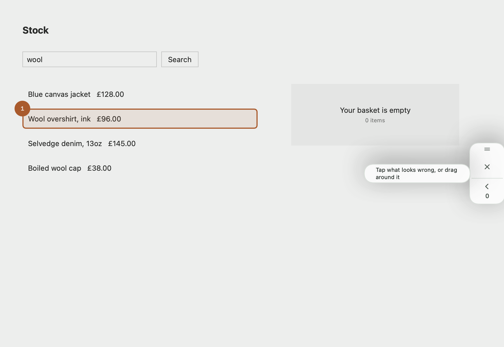 | 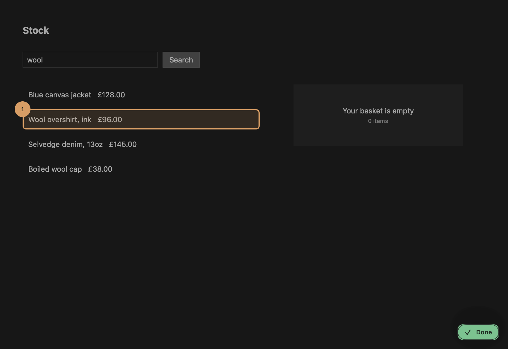 |

Say what is wrong. Everything else about that moment is captured for you:

| | |
|---|---|
|  | 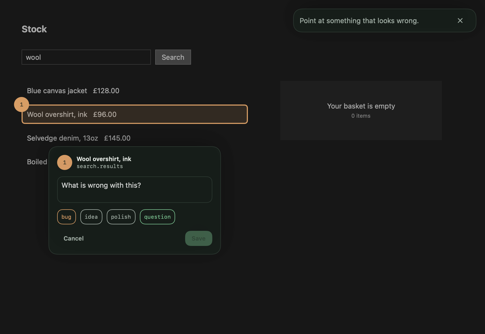 |

**While you annotate, Loupe leaves one thing on your app: a pull on the edge.** It
carries the whole job - Send, and a cross to finish - so the four steps are four taps
and none of them is hidden: tap the pill, point or drag, type, Send, done. Drag the
pull up or down to slide it off whatever you are trying to point at. Tap it, or drag
it inward, and the drawer comes out with every note and the settings:

| | |
|---|---|
| 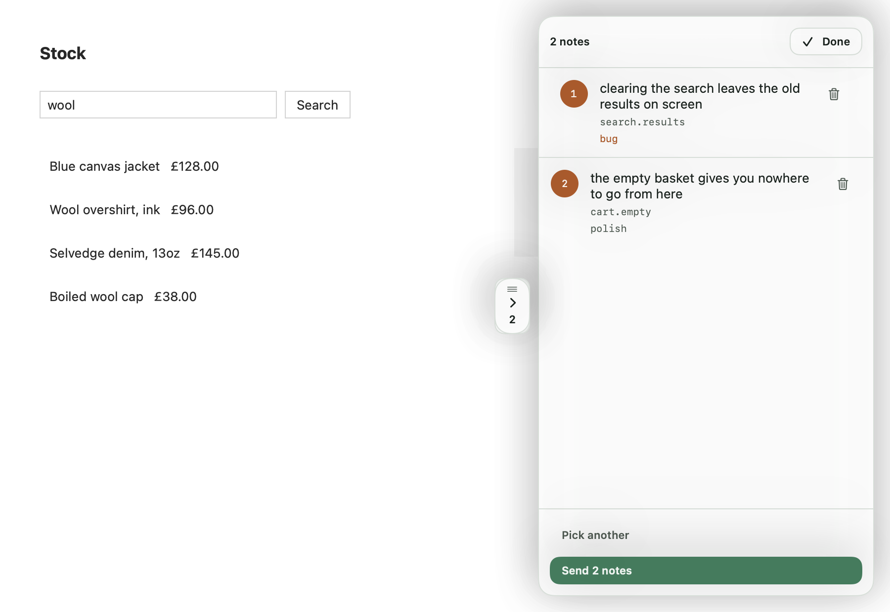 | 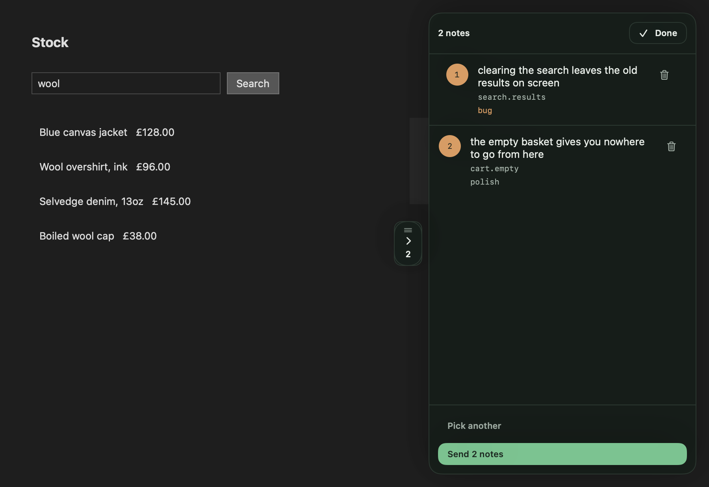 |

The drawer never opens itself. Saving a note changes the number on the pull and
nothing else, so the layout under your hands stays where you left it - and you are
straight back to picking, because making *annotations* is the ordinary case and it
should not need a button found between each one.

Each note is one row: a thumbnail, two lines of what you said, and the endpoint
behind it. Tap the words to rewrite them; tap the picture to see the whole thing. A
drawer full of notes is a list you scan, not a gallery.

### It can wear your design system

Loupe's own look is a warm orange, on purpose: an overlay has to read as a tool, not
as part of the app underneath it. But an app with an accent of its own gets to say
so, and then the overlay stops looking like a visitor:

```swift
Loupe.start(app: app, theme: LoupeTheme.Appearance(
    accent: .init(light: .init(hex: 0x4338CA), dark: .init(hex: 0xA5B4FC)),
    action: .init(light: .init(hex: 0x4338CA), dark: .init(hex: 0xA5B4FC)),
    panelRadius: 28,
    controlRadius: 20))
```

Same overlay, same notes, four lines of tokens apart:

| | |
|---|---|
|  | 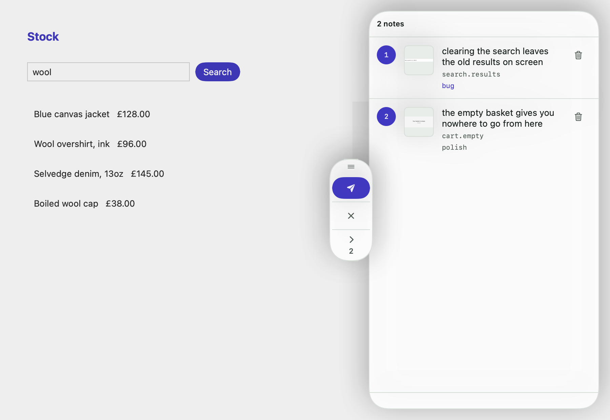 |
|  | 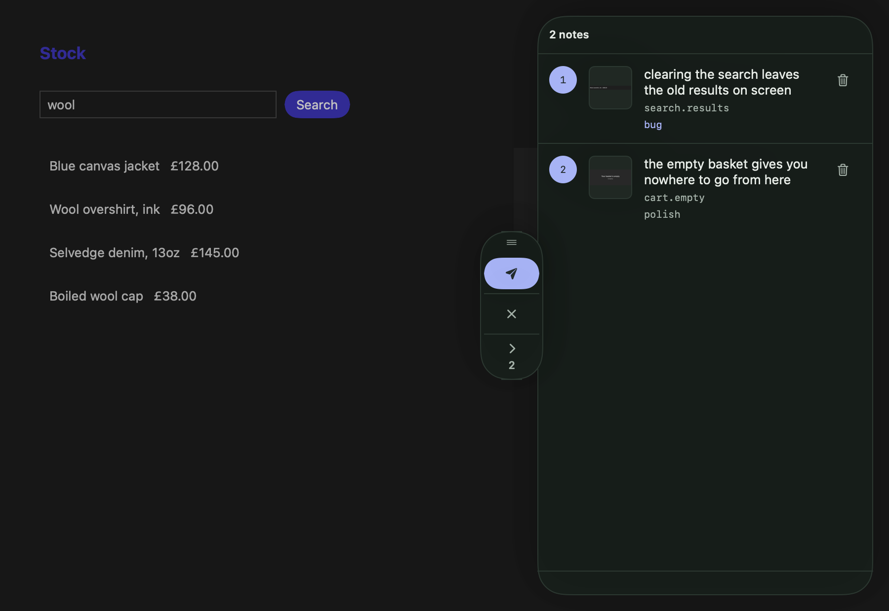 |

Every field has a default, so you name only what you have an opinion about, and the
wash inside a picked element follows your accent without being asked. Omit the
argument entirely and nothing changes.

**This is not a styling API.** There are no per-control overrides and no slots for
your own views: colours, two radii and four fonts. An overlay that can be restyled
arbitrarily becomes a UI framework, and the point is for this one to disappear into
your app. `DESIGN.md` lists every token.

The web SDK takes the same tokens, as CSS strings, so a page can point Loupe straight
at a variable it already has: `start({ app, theme: { accent: "var(--brand)" } })`.
See [`web/README.md`](web/README.md).

Drag to say "this bit", on any platform. The rectangle is dashed while you draw it
and solid once it is yours:

| | |
|---|---|
| 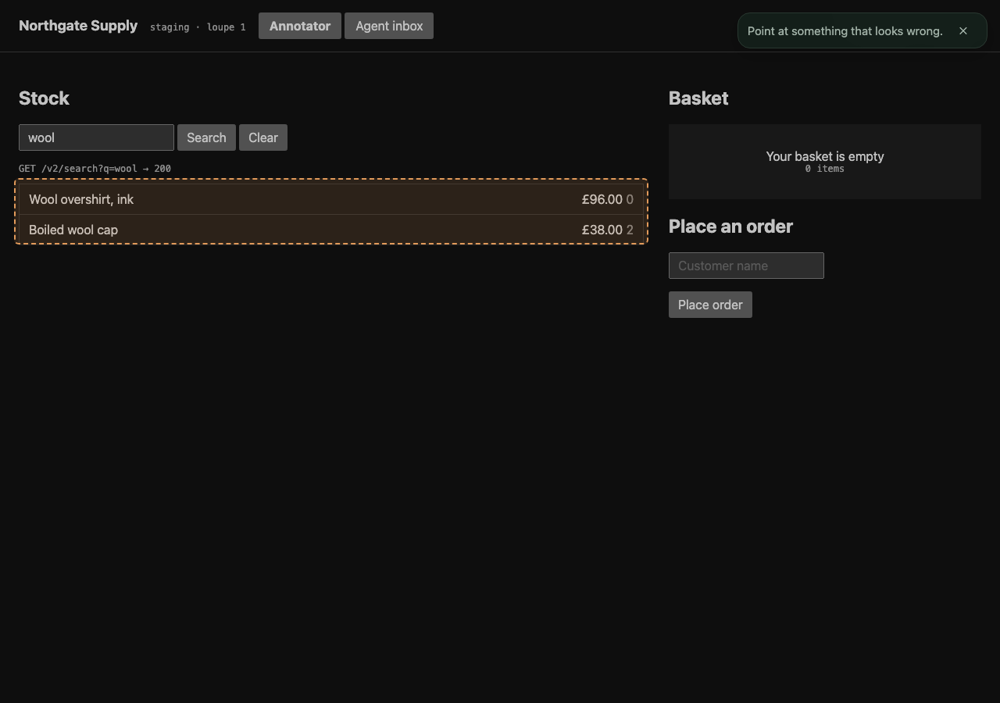 | 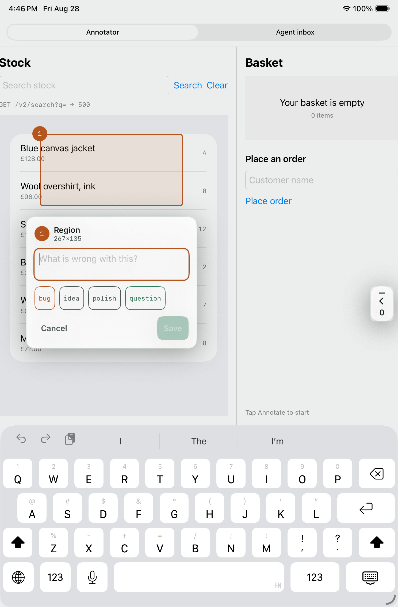 |

On an iPad the drawer is a side panel; on an iPhone it becomes a bottom sheet:

| | |
|---|---|
| 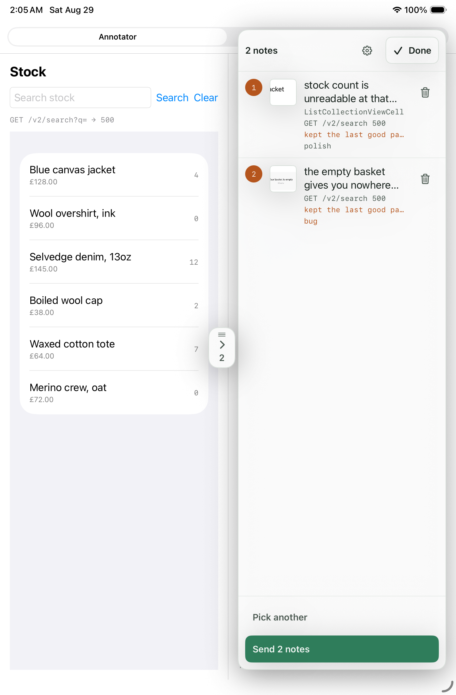 | 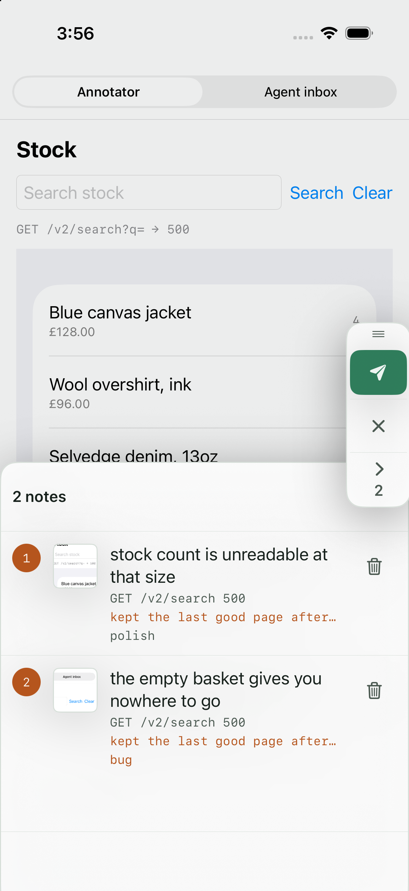 |

Picking an element on an iPad, with the drawer shut:

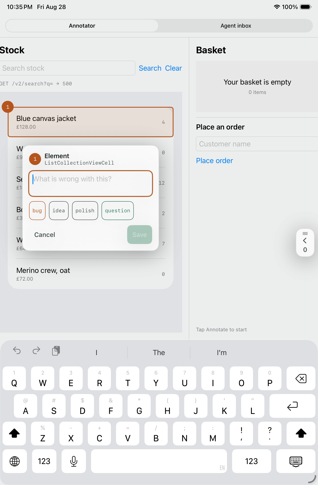

The same thing on the web, in Chromium:

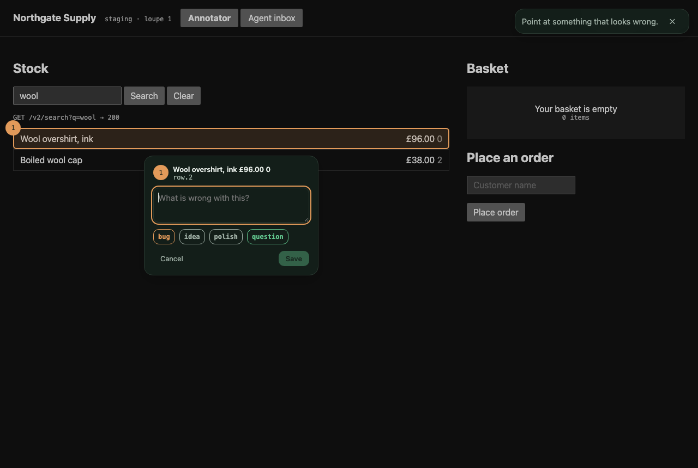

Every colour, size and duration comes from [`DESIGN.md`](DESIGN.md), through
[`docs/tokens.json`](docs/tokens.json), which both SDKs are tested against.

## Try it

A seeded demo app with two roles - annotate it, then read what an agent receives.

```sh
# macOS
cd Examples/LoupeDemo && swift run LoupeDemo

# web
cd web && npm install && npm run build && python3 -m http.server 8765
# then open http://127.0.0.1:8765/demo/index.html
```

Both are a small stock admin with three things wrong with them on purpose, making real
network calls so the captured trace is genuine rather than mocked.

## How it works

Two pieces, and only one of them is hard.

**The picker.** Hit-testing returns the deepest view under your finger, which is usually
a label inside the thing you meant. Loupe climbs to the nearest *meaningful* ancestor,
one the app has named or one that is an interactive control, and stops before it swallows
a whole container. Then it renders that view directly, so the crop needs no rectangle
maths. Getting this right is the whole correctness burden: a wrong crop makes every
downstream step reason about the wrong element.

**The recorder.** A ring buffer of recent requests, installed as a `URLProtocol`. This is
the linkage that ties a UI element to backend code, instead of leaving an agent to guess
which endpoint a screen calls.

## Status

Pre-1.0, and working end to end on every platform it claims: the picker, the recorders,
the transports, the offline queue, the overlay, the drawer, and a seeded two-role demo on
macOS, iPad, iPhone and the web. Run and screenshotted on the iPad and iPhone
simulators; not yet on physical hardware.

The [bundle format](docs/bundle-format.md) is version 1 and has a
[JSON Schema](docs/bundle-format.schema.json). Adding a field is safe; renaming or
removing one is not.

See the [Linear project](https://linear.app/serhii-kucherenko/project/loupe-8fd34fb80084).

## Licence

MIT. See [LICENSE](LICENSE).
